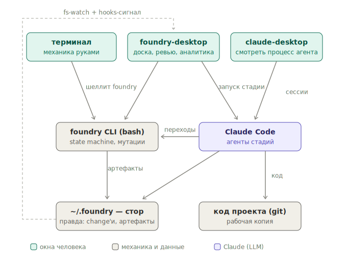
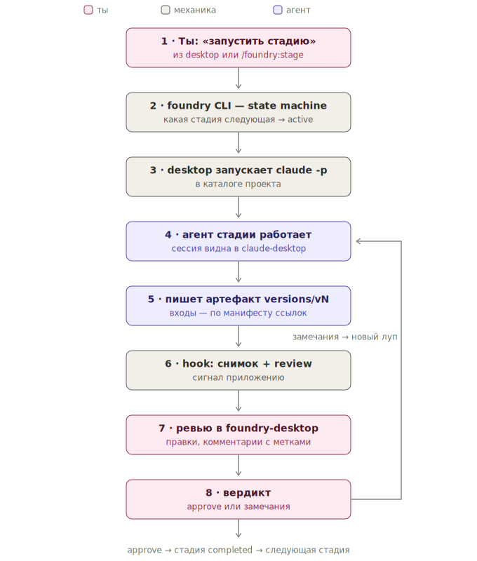
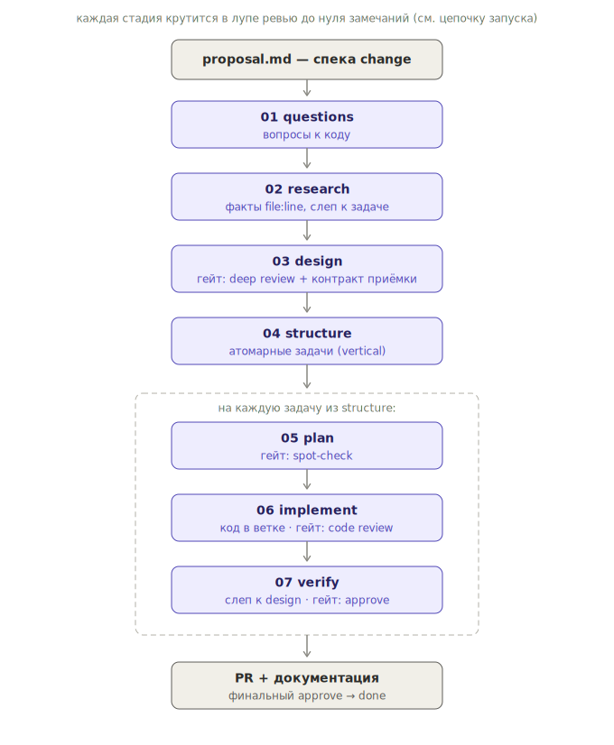
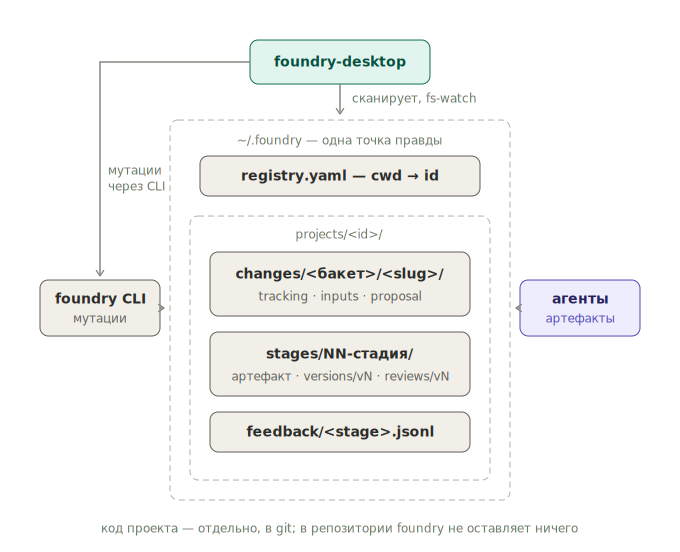
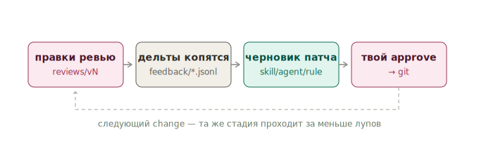

# foundry — Карта компонентов

> Живая карта: из чего состоит система, как change обрастает артефактами по
> стадиям, и где живёт машина самоулучшения. Верхний слой — [REQUIREMENTS.md](REQUIREMENTS.md)
> (что и зачем), [ROADMAP.md](ROADMAP.md) (фазы), [foundry-desktop.md](foundry-desktop.md)
> (приложение). `★` = узлы, обеспечивающие самоулучшение.

---

## Схемы

Как всё связано — пять картинок ([diagrams/](diagrams/)):

**Карта системы** — окна (терминал, foundry-desktop, claude-desktop), движки
(foundry CLI, Claude Code), данные (стор, git); кто кого зовёт:



**Цепочка запуска стадии** — от кнопки до вердикта, с петлёй переделки;
число витков = versions/vN = метрика качества:



**Путь change по конвейеру** — стадии, гейты, изоляция (research слеп к
задаче, verify — к design), пер-задачный цикл после structure:



**Хранилище и доступ** — одна точка правды, desktop читает, CLI мутирует,
агенты пишут артефакты по правам:



**Цикл самоулучшения** — правки → дельты → черновик патча → approve:



---

## Вход → агент → выход по стадиям

| Стадия | Вход | Агент | Выход (артефакт) | Ревью |
|---|---|---|---|---|
| questions | `proposal.md` | questioner | `questions.md` — вопросы к коду | — |
| research | `questions.md` (без proposal) | researcher + scout | `research.md` — факты `file:line` | — |
| design | proposal + research | designer | `design.md` + `validation-contract.md` | глубокое, человек |
| structure | `design.md` | outliner | `structure.md` = список задач | spot-check |
| *далее — по каждой задаче* | | | | |
| plan | одна задача | planner | `plan/<task>.md` — шаги + до/после | spot-check |
| worktree | — | bash | git-ветка | — |
| implement | `plan/<task>.md` + код | implementor | код (diff) + handoff | code review, человек |
| verify | `validation-contract.md` + код (без design/plan) | verifier | `verify-report.md` — PASS/FAIL | approve |
| pr | всё | bash | PR + доки | финальный approve |

**Атомарная задача** — выход стадии structure: вертикальный слайс, который
компилируется и проходит тесты сам по себе (разбить дальше — сломается). По
каждой задаче отдельно крутится plan → implement → verify.

**Цикл ревью:** артефакт → `review` → замечания или approve. Есть замечания →
агент переделывает → снова `review`. По кругу до нуля замечаний → `completed`.

---

## Плагин `foundry` (этот репозиторий)

Движок + агенты + скиллы + правила.

```
foundry/
├── .claude-plugin/
│   ├── plugin.json  marketplace.json          # паспорт плагина
│
├── agents/                                    # промпты стадий (≤40 инструкций)
│   ├── questioner.md        # proposal → questions
│   ├── researcher.md        # questions → research (без proposal)
│   ├── research-scout.md    # нырок в код для researcher
│   ├── designer.md          # research+proposal → design + критерии
│   ├── outliner.md          # design → список задач
│   ├── planner.md           # задача → план
│   ├── implementor.md       # план+код → код
│   ├── verifier.md          # критерии+код → PASS/FAIL
│   └── calibrator.md   ★    # дельты → черновик правки skill/agent/rule
│
├── skills/
│   ├── spec/                                  # контракты стадий: как + чего нельзя
│   │   ├── questions-contract/  research-contract/  design-contract/
│   │   ├── validation-contract/ structure-contract/ plan-contract/
│   │   ├── verify-contract/  naming-guide/  lifecycle-reference/  lint-guide/
│   └── domain/                                # Kotlin/Spring/SOLID — растут из калибровки
│       └── kotlin-guide/  spring-guide/  solid-guide/
│            └─ SKILL.md: в шапке ЗОНА скилла   # ★ за что отвечает (для атрибуции правок)
│
├── commands/                                  # входы человека в сессию Claude
│   ├── change.md  setup.md  stage.md
│   ├── calibrate.md    ★    # просмотр и approve черновиков улучшений
│   └── quickfix.md  jira.md
│
├── hooks/
│   ├── hooks.json
│   └── on-stage-complete.sh  ★                # авто-триггер: снимок + запись дельты
│
├── scripts/cli/                               # bash-движок, слоями
│   ├── app                                    # загрузка + диспетчер
│   ├── config/              # реестр бакетов, дефолты, ПОРОГИ калибровки ★
│   ├── spec/                                  # правила CRISPY
│   │   ├── state-machine.sh                   # переходы — единственный источник
│   │   ├── slug.sh
│   │   ├── stages/     ★    # на стадию: какие скиллы грузим + какие гейты
│   │   │   └── questions.yaml research.yaml design.yaml … verify.yaml
│   │   ├── calibrate.sh ★   # считает повторы, проверяет порог, зовёт calibrator
│   │   └── lint/           # валидаторы = инструменты для правил
│   │       └── line-count.sh opinion-words.sh instruction-count.sh horizontal-pattern.sh
│   ├── store/                                 # данные
│   │   ├── change.sh tracking.sh query.sh template.sh index_cache.sh
│   │   └── feedback.sh  ★   # пишет/читает снимки и дельты
│   ├── render/             # рисование TUI
│   ├── commands/           # plain-подкоманды (cmd_*)
│   └── pages/              # интерактивные экраны
│
├── tests/                  # сьюты + harness + раннер
├── roadmap/                # CRISPY 12-FACTOR NO-VIBES MISSIONS · ROADMAP REQUIREMENTS foundry-desktop components
└── CLAUDE.md               # нейминг-доктрина
```

---

## Хранилище данных — глобальное, одна точка правды

**Решение:** данные живут НЕ в папке проекта, а в глобальном сторе (как
проекты claude-desktop). В репозитории проекта — ничего (ни данных, ни
симлинков); AI-процесс не касается git проекта вовсе. Данные переживают
re-clone и перенос проекта. Durable-«почему» уезжает в PR/CHANGELOG/vault.

Раскладку создаёт `setup` из скелета [`.store/`](../.store) этого репозитория —
копированием каталога целиком, со снятием `.gitkeep` на месте (git не хранит
пустых каталогов, поэтому в репозитории они помечены этим файлом). Скелет —
единственное место, где раскладка задана исполнимо; текст ниже её объясняет, но
не дублирует. Код `setup` на неё ещё не переведён — он едет вместе с переездом
стора.

В скелете лежит то, что существует сразу: сам стор и заготовки. Каталоги
`projects/<id>/`, `changes/<slug>/` и `stages/<NN>-<stage>/` в нём не лежат и
лежать не могут — они появляются под данные, которых при установке ещё нет.
Зато форма каждого из них задана заготовкой в `templates/`, так что структура
целиком видна в репозитории, а не только в этом тексте.

```
~/.foundry/                          # не под git: откат — повторным прогоном стадии
├── VERSION                          # версия раскладки, одна строка
├── config/                          # настройки по умолчанию на все проекты
│   ├── common.yaml                  # читают и CLI, и приложение
│   └── cli.yaml                     # только CLI: сортировка, лимиты списка
├── templates/                       # заготовки, из которых рождается новое
│   ├── pipelines/<type>.yaml        # категория задач → её список стадий
│   ├── project/                     # каким заводится projects/<id>/
│   ├── change/                      # каким рождается changes/<slug>/
│   └── stage/                       # каким стартует stages/<NN>-<stage>/
├── observability/                   # следы прогонов
│   └── metrics/<YYYY-MM>.tsv        # строка на прогон и на возврат, файл на месяц
├── cache/                           # сносимая зона: rm -rf безопасен всегда
│   ├── review-queue.yaml            # что ждёт ревью по всем проектам
│   └── tasks.yaml                   # задачи поперёк проектов
└── projects/<id>/                   # каталог на проект, id = имя репозитория
    ├── project.yaml                 # путь к репозиторию, имя, метаданные
    ├── config.yaml                  # переопределения + разрешённые категории
    ├── templates/                   # проектные версии заготовок
    ├── feedback/<stage>.jsonl    ★  # вход калибровки, только дописывается
    └── changes/<slug>/              # одно изменение, путь стабилен навсегда
        ├── proposal.md              # спека: что делаем и зачем
        ├── tracking.yaml            # статус, текущая стадия, стадии, ветка
        ├── history.log              # события, включая возвраты
        └── stages/<NN>-<stage>/     # 01-questions … 07-verify
            ├── stage.yaml           # статус стадии, круги и чем вызван каждый
            ├── input/               # что дано стадии на вход
            │   ├── manifest.yaml    # ссылки на чужое + отпечатки
            │   └── …                # файлы без другого дома: лог, схема
            ├── output/<stage>.md    # результат — только это видят соседи
            └── rounds/v1/           # кухня: круг = папка
                ├── draft.md         # сырой вывод агента, до правок
                └── review.md        # твои замечания + адресат
```

Наполнение `output/` своё у каждой стадии: у `03-design` рядом с `design.md`
лежит `validation-contract.md` (без него state machine стадию не закроет), у
`04-structure` — `structure.md` для человека и `tasks.yaml` машине.

Стадий два вида, и отличаются они одним уровнем в `rounds/`. Стадия на весь
change (`01`–`04`, `07`) кладёт круги в `rounds/vN/`. Стадия по задачам
(`05-plan`, `06-implement`) разложена по ним и в выходе, и в кухне:

```
stages/05-plan/
├── stage.yaml
├── input/                            # один на всю стадию: дизайн, структура
├── output/01-<task>.md 02-<task>.md  # результат по каждой задаче
└── rounds/01-<task>/v1/{draft.md, review.md}
```

Задача — не вход стадии, а то, по чему стадия разложена: во `input/` она не
попадает никогда, её имя — это имя файла в `output/` и каталога в `rounds/`.
Поэтому `output/` сохраняет смысл (всё, что читают соседи, и только оно), а
изоляция агентов по-прежнему пишется одной строкой `stages/*/output/**`.

Правила раскладки (2026-07-17):
- **Статус — поле в `tracking.yaml`, не место.** Переход = переписать одно
  поле; атомарность даёт запись во временный файл и `mv` поверх — та же
  гарантия, что давал перенос каталога. Зато путь изменения не меняется за всю
  его жизнь, и всё, что на него ссылалось — манифесты входов, строки метрик,
  путь рабочей копии, ссылка в PR, вкладка в приложении, — не протухает.
  Прежний довод против префикса в имени (`[...]` — метасимвол глоббинга) к
  полю не относится: он был против статуса в имени файла, а не за каталог.
- **Пайплайн разворачивается один раз.** `templates/pipelines/<type>.yaml`
  читается при создании изменения: список стадий уезжает в его
  `tracking.yaml`, оттуда же берутся номера `<NN>`. Правка шаблона не
  переписывает задним числом то, что уже в работе. Там же поле `per_task` —
  какие стадии идут по задачам; это свойство пайплайна, а не знание кода.
- **Задачи заводит `04-structure`, машинным списком.** `structure.md` — текст
  для человека, из него имена задач доставать нечем: парсить LLM-вывод
  регулярками мы не будем. Поэтому у структуры два выхода, как у дизайна:
  `structure.md` и `tasks.yaml` — плоский список, из которого берутся имена
  `01-<task>` в стадиях по задачам.
- **Своего состояния у задачи нет.** «Задача 3 спланирована, но не
  реализована» нигде не записано — это видно по тому, какие файлы есть. Пока
  задача просто способ поделить работу двух стадий, отдельной правды она не
  заводит. Понадобится отклонять, возвращать или показывать задачу отдельно —
  ей понадобится и состояние, а с ним и свой уровень в раскладке; доска у нас
  из change'ей, так что этот день не близко.
- **`input/` + `output/` — контракт стадии, `rounds/` — кухня.** Соседние
  стадии читают только `output/`, внутрь `rounds/` не смотрит никто. Это не
  эстетика: изоляция стадий делается абсолютными паттернами в `allowed-tools`,
  и так она пишется одной строкой `stages/*/output/**`, а не перечислением
  файлов поимённо.
- **Вход — на стадию, а не на круг.** Второй круг случается не потому, что
  вход поменялся, а потому, что не устроил выход. У чего есть дом — ссылка с
  отпечатком содержимого в `input/manifest.yaml`; у чего дома нет (выгрузка
  лога, схема, скриншот) — файл лежит прямо в `input/`. Дублей нет, бездомных
  нет. Поменялся вход — отпечатки перестают сходиться, это видно.
- **Ревью несёт адресата.** По умолчанию — своя стадия. Указана более ранняя —
  это возврат: событие в `history.log`, текущая стадия откатывается,
  промежуточные получают в своём `stage.yaml` статус «устарело», целевая —
  новый круг с пометкой, чем он вызван. Новых каталогов возврат не требует:
  это причина круга, а не новая сущность. Замечание может быть написано на
  реализации, а адресовано дизайну — черновик реализации бывает безупречен и
  честно реализует плохой дизайн.
- **Круг и возврат — разные события.** В метриках возврат — отдельный вид
  строки, не круг. Иначе «лупов всё меньше» смешает переписанный черновик с
  возвратом на дизайн, а это разница в цене на порядок, и метрика соврёт в
  успокаивающую сторону. Калибровка относит возврат к целевой стадии: строка
  ложится в `feedback/design.jsonl`, а не `implement`, потому что дефект там.
  Возврат — самый ценный сигнал из всех: навык пропустил дефект, переживший
  ревью и всплывший через три стадии.
- **Состояние изменения и состояние стадии не пересекаются.** В
  `tracking.yaml` — статус изменения и какая стадия текущая; в `stage.yaml` —
  только своя стадия: статус, круги, чем вызван каждый, id сессии, чем
  произведено. Одно и то же в двух местах однажды разойдётся.
- **Списка проектов нет — есть каталог `projects/`.** Проект по каталогу ищем
  обходом `projects/*/project.yaml`; на двадцати проектах это мгновенно.
  Отдельный `registry.yaml` был бы вторым списком тех же проектов — а два
  списка одного и того же однажды разойдутся, и чинить придётся руками.
  Станет медленно — положим индекс в `cache/`, но как кеш, а не как правду.
- **Пишет только CLI.** Desktop читает файлы напрямую (быстрый рендер), но не
  пишет в стор никогда — любая правка идёт через `foundry`. Пока писатель
  один, консистентность держат атомарные записи, и локи не нужны.
- **Ленту прогона не копируем.** Claude Code уже пишет сессию в
  `~/.claude/projects/<путь>/<id>.jsonl`. Держим в `stage.yaml` только id
  сессии; лента читается оттуда. Копия — это мегабайты в двух местах.
- **Метрики — журнал фактов, не отчёт.** `observability/metrics/<YYYY-MM>.tsv`,
  строка на прогон и на возврат, TSV — как `history.log`: bash пишет без сети и
  без сторонних утилит, а экран расхода читает один файл за месяц вместо обхода
  всего стора. Отчёты и доли считает тот, кто показывает. Это не отменяет отказ
  от токенов как порога ([ROADMAP](ROADMAP.md), «Smart Zone» в списке того, что
  не enforce'им): порог гнал бы агента, а факт просто записан после прогона.
- **`cache/` — сносимая зона.** Всё, что там лежит, обязано пересобираться из
  `projects/`. `rm -rf cache/` — всегда безопасная команда.
- **Базы данных нет.** Индекс, треды ревью, история дельт, настройки — у всех
  четырёх уже есть файловое место. База завелась бы как вторая копия того же.
  Заведём, если кросс-проектный вид начнёт читать тысячи файлов.
- **Навыков в сторе нет.** Агент физически не читает файлы оттуда — только из
  мест Claude Code. Общие навыки — в репозитории плагина, проектные добавки —
  в `<проект>/.claude/skills/`. Второе — записанное исключение из «в
  репозитории проекта ничего нашего нет»: знание про проект принадлежит
  проекту, версионируется с его кодом и приезжает к тому, кто его склонировал.
  Оба места под git, откат бесплатный.
- **Рабочих копий кода в сторе нет.** Код — это git проекта, а не наши данные;
  стор обязан оставаться тем, что можно снести. Изменение помнит ветку и путь
  рабочей копии в `tracking.yaml`, а кто её создаёт — решается на фазе 6.

Механика доступа:
- **Права** — один раз на пользователя: `~/.foundry/**` в permissions
  (`settings.json`); изоляция стадий — абсолютными паттернами в
  `allowed-tools` (researcher: `01-questions/output/**` можно, `proposal.md`
  нельзя).
- **Поиск проекта** — CLI: cwd → обход `projects/*/project.yaml` →
  `projects/<id>`; worktree'ы — через `git rev-parse --git-common-dir` (один
  репозиторий = один id). Перенос проекта = поправить путь в `project.yaml`.
- **Desktop** — сканирует `~/.foundry/projects/` — тот же обход, тот же ответ.
- **Плагин** глобален по определению (ставится один раз); `setup` = скелет
  `.store/` → `~/.foundry/` при первой установке, `projects/<id>/` на проект,
  плюс permissions.

Не решено (раскладку не двигает, но правила поверх неё — да):
- Ветка и рабочая копия — на change или на задачу. Сейчас `branch` и
  `worktree` лежат в `tracking.yaml` change'а, и это согласуется с тем, что у
  задачи нет своего состояния. Но [ROADMAP](ROADMAP.md) на фазе 6 поминает
  worktree в per-task контексте; если копия на задачу — её негде записать, и
  задаче придётся завести состояние.
- `config/desktop.yaml` — существует ли. Записанное решение отдаёт настройки
  приложения UserDefaults; кандидат — делить по природе: осмысленное в стор,
  положение окна в UserDefaults.
- `observability/logs/` — какие логи. Про ленту прогона решение уже есть — не
  копируем; если под логами имелась в виду она, каталога не будет.
- Экспорт метрик в Prometheus. План: TSV остаётся правдой, отдельная команда
  выводит из него накопительные счётчики с метками конечной кардинальности
  (`project`, `stage`, `verdict`; slug и сессия — нет) и отдаёт локально
  textfile-коллектором или удалённо через Pushgateway. `remote_write` отпадает:
  protobuf+snappy из bash без зависимостей не собрать.
- Какие возвраты разрешает state machine. Правдоподобно «на любую более
  раннюю», но это решение, а не самоочевидность.
- Снимок утверждённого текста в круге. Сейчас нет: перезапуск устаревшей
  стадии затирает прежний утверждённый `output/<stage>.md`, в `rounds/`
  остаются только сырые черновики. С возвратами это стало заметнее.
- Неверная спека — возврат в точку без стадии (правим `proposal.md`, все
  стадии устаревают разом) или новое изменение.
- Как уложить круги в `stage.yaml` плоско. YAML у нас парсится grep/awk, схема
  плоская by design; список кругов, где у каждого своё «чем вызван», на flat
  YAML ещё не спроектирован.

---

## Приложение `foundry-desktop` (отдельный репозиторий, Swift/SwiftUI)

Стек выбран 2026-07-14: нативное macOS-приложение. Подпроцессы, слежение за
файлами и git — родная территория Foundation. Отклонены Compose for Desktop
(не нативно) и SPA + Spring Boot (вкладка, а не окно).

```
foundry-desktop/
├── список проектов + слежение за ~/.foundry/ (FSEvents)
├── оркестратор — шеллит foundry, гоняет claude -p
├── ревью-интерфейс — правки, diff, комментарии, loop
├── калибровка — черновики улучшений → твой approve
└── аналитика — счётчик лупов (он же сигнал улучшения)
```

Базы у приложения нет — читает стор напрямую. Своё держит там, где положено
приложению macOS (настройки — в UserDefaults), а не в общем сторе.

Связь двух репозиториев — только через файлы `~/.foundry/` и вызовы CLI:
приложение можно менять, не трогая ядро.

---

## Машина самоулучшения (узлы `★`, поток)

На **каждом** витке ревью, автоматически:

1. `hooks/on-stage-complete.sh` — снимает снимок вывода агента → `.snapshots/`.
2. ты правишь и комментируешь → `reviews/<stage>.md` (правки + метки тем).
3. `store/feedback.sh` — пишет дельту (что изменилось) + чем произведено
   (агент, скиллы, правила) → `feedback/<stage>.jsonl`.
4. `spec/calibrate.sh` — копит, ловит повтор одной правки ≥ N (порог в `config/`).
5. `agents/calibrator.md` — рисует черновик правки; цель — **любое из наших**:
   скилл / промпт агента / правило (что именно — из метки темы vs зоны скилла).
6. `commands/calibrate.md` — ты просматриваешь и одобряешь; git хранит и
   откатывает.

Автоматически: снимок, запись дельты, проверка порога, черновик. Твоё: ревью и
финальный approve. Единственное, что не автоматизировано, — суждение.

**Атрибуция** (какой скилл виноват, если их несколько): метка темы правки →
зона скилла (объявлена в его шапке). Один совпал → правим его; двое →
перекрытие зон, правим границу; ни один → новый скилл; нет повтора → не про
скиллы (агент/задача).
